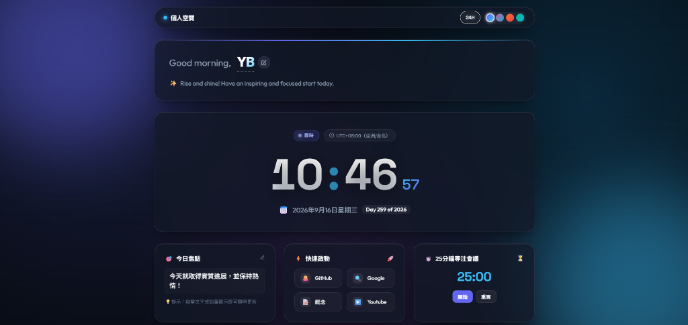

# ✨ Personal Space & Real-Time Clock Hub

一個現代化、優雅且具備毛玻璃（Glassmorphism）美學質感的個人專屬數位時鐘儀表板（Personal Hub）。

[](https://developer.mozilla.org/en-US/docs/Web/HTML)
[](https://developer.mozilla.org/en-US/docs/Web/CSS)
[](https://developer.mozilla.org/en-US/docs/Web/JavaScript)
[](LICENSE)

---

<p align="center">
  
</p>

---

## 🌟 主要功能亮點 (Key Features)

### 1. 🕒 高精度即時數位時鐘 (High-Precision Real-Time Clock)
- **實時秒數更新**：流暢計時與呼吸冒號動畫。
- **12H / 24H 格式自由切換**：支援 24 小時制與 12 小時 AM/PM 顯示，切換設定自動儲存。
- **完整日期與時區檢測**：顯示在地化完整年月日、星期、年度第幾天標籤（Day of Year）及系統時區（例如 `UTC+08:00 (Asia/Taipei)`）。

### 2. 👋 動態時段問候與自訂姓名 (Personalized Greeting & Name)
- **時間感應問候語**：依據早晨、下午、傍晚與深夜自動切換相應的親切問候。
- **即時編輯姓名**：點擊名稱或鉛筆按鈕即可直接編輯姓名，並自動同步儲存至瀏覽器 `localStorage`，重新整理頁面依然保留。

### 3. 🎨 極致視覺美學與 4 款主題 (Glassmorphic Aesthetics & Themes)
- **現代毛玻璃質感**：背景浮動光暈、柔和邊框發光與深邃毛玻璃效果。
- **一鍵切換 4 色主題**：
  - 🌌 **Aurora** (極光靛藍 - 預設)
  - 🔮 **Cyber** (賽博霓虹紫)
  - 🌅 **Sunset** (暮光暖橙)
  - 🌲 **Emerald** (午夜翡翠綠)

### 4. 🚀 效率小工具 (Productivity Widgets)
- **🎯 Focus of the Day**：每日核心目標備忘，隨點即改並自動儲存。
- **⚡ Quick Launch Dock**：快速啟動常用工具與捷徑（GitHub, Google, Notion, YouTube）。
- **⏱️ 25-Min Focus Session**：內建番茄鐘計時器，支援開始、暫停與重置。

---

## 📁 專案架構 (Project Structure)

```text
├── index.html        # 語意化 HTML5 結構與儀表板卡片
├── style.css         # 設計規範系統、CSS 變數、響應式佈局與 4 色主題
├── app.js            # 時鐘引擎、問候演算法、即時編輯與本地快取邏輯
├── .gitignore        # Git 忽略配置
└── README.md         # 專案說明文件
```

---

## 🚀 快速上手 (Quick Start)

無需安裝龐大依賴，純原生 Web 技術構建：

### 方法一：直接點擊開啟
直接使用任何現代瀏覽器（Chrome, Edge, Firefox, Safari）雙擊打開 `index.html` 即可使用。

### 方法二：透過本機 HTTP 伺服器運行
```bash
# 使用 Python 內建伺服器
python -m http.server 3000

# 或使用 Node.js npx serve
npx serve .
```
開啟瀏覽器訪問 `http://localhost:3000` 即可體驗！

---

## 🛠️ 技術棧 (Tech Stack)

- **核心**：HTML5, Vanilla CSS3, Modern ES6+ JavaScript
- **字體設計**：Google Fonts ([Outfit](https://fonts.google.com/specimen/Outfit), [Space Grotesk](https://fonts.google.com/specimen/Space+Grotesk), [JetBrains Mono](https://fonts.google.com/specimen/JetBrains+Mono))
- **資料儲存**：瀏覽器 Web Storage API (`localStorage`)

---

## 📄 授權協議 (License)

本專案採用 [MIT License](LICENSE) 開源授權。
