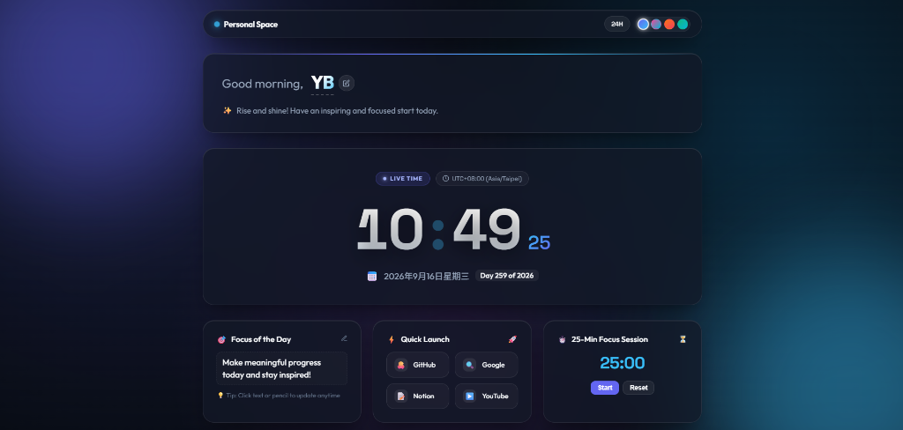

# ✨ 施閔翎 (Min-Ling Shih) | Personal Space & Portfolio Hub

一個專為 **施閔翎** 打造的現代化、優雅且具備毛玻璃（Glassmorphism）質感的個人數位空間與作品集儀表板。

[](https://developer.mozilla.org/en-US/docs/Web/HTML)
[](https://developer.mozilla.org/en-US/docs/Web/CSS)
[](https://developer.mozilla.org/en-US/docs/Web/JavaScript)
[](LICENSE)

---

<p align="center">
  
</p>

---

## 🌟 核心功能特色 (Key Features)

### 👤 1. 個人檔案 (Profile)
- **姓名**：施閔翎
- **個人照片 / Avatar**：百變怪 (Ditto) 專屬發光頭像框，支援點擊更換。
- **科系 / 專長**：資工系 · 自然語言處理 (NLP)
- **簡短自介**：專注於自然語言處理 (NLP)、機器學習與演算法研究，熱衷探索智慧技術與多元應用。

### 🛠 2. 專業技能 (Skills)
- 🐍 **Python**（程式語言 / AI 開發）
- ⚡ **C++**（核心程式 / 高效能運算）
- 🧠 **Machine Learning**（機器學習 / 演算法）
- 支援透過編輯器自由增刪與自訂技術標籤。

### 🚀 3. 精選專案 (Projects)
- 📦 **ai-trashcan**：
  - **簡介**：基於機器學習與電腦視覺之智慧垃圾分類辨識系統，實現自動化辨識與資源回收分流。
  - **技術標籤**：`Python` `Machine Learning` `Computer Vision` `IoT`
  - **GitHub 連結**：[https://github.com/yb-802/ai-trashcan.git](https://github.com/yb-802/ai-trashcan.git)

### ✏️ 4. 即時修改個人檔案 (Interactive Profile Editor)
- 點擊「**編輯個人檔案**」按鈕可喚起彈出式編輯視窗。
- 支援修改姓名、科系與專長、自我介紹、技能清單、大頭貼（支援上傳新圖片或貼上網址）及專案內容。
- 所有變更即時更新並自動儲存至瀏覽器本地快取（`localStorage`），亦提供「重設為預設值」按鈕。

### 🕒 5. 高精度即時數位時鐘 & 美學主題
- **實時秒數更新**：流暢計時、呼吸動畫冒號與毫秒級同步。
- **12H / 24H 自由切換**：支援 24 小時制與 12 小時 AM/PM 顯示。
- **完整日期與時區檢測**：顯示完整年月日、星期、Day of Year 標籤與時區。
- **一鍵切換 4 色毛玻璃主題**：
  - 🌌 **Aurora** (極光靛藍 - 預設)
  - 🔮 **Cyber** (賽博霓虹紫)
  - 🌅 **Sunset** (暮光暖橙)
  - 🌲 **Emerald** (午夜翡翠綠)
- **效率工具組**：每日焦點備忘錄 (Focus of the Day)、常用連結快速啟動 (Quick Launch) 以及 25 分鐘番茄鐘專注計時器。

---

## 📁 專案架構 (Project Structure)

```text
├── assets/
│   ├── avatar.png    # 施閔翎 個人頭像 (Ditto Avatar)
│   └── preview.png   # 儀表板畫面預覽截圖
├── index.html        # 語意化 HTML5 結構與個人主頁卡片
├── style.css         # 毛玻璃設計系統、響應式佈局與 4 款主題
├── app.js            # 個人檔案管理、時鐘引擎、彈窗邏輯與快取持久化
├── .gitignore        # Git 忽略配置
└── README.md         # 專案說明文件
```

---

## 🚀 快速上手 (Quick Start)

無需安裝龐大依賴，純原生 Web 技術構建：

### 方法一：直接點擊開啟
使用任何現代瀏覽器（Chrome, Edge, Firefox, Safari）雙擊打開 `index.html` 即可使用。

### 方法二：透過本機 HTTP 伺服器運行
```bash
# 使用 Python 內建伺服器
python -m http.server 3000

# 或使用 Node.js npx serve
npx serve .
```
開啟瀏覽器訪問 `http://localhost:3000` 即可體驗！

---

## 🛠️ 技術棧 (Tech Stack)

- **核心**：HTML5, Vanilla CSS3, Modern ES6+ JavaScript
- **字體設計**：Google Fonts ([Outfit](https://fonts.google.com/specimen/Outfit), [Noto Sans TC](https://fonts.google.com/specimen/Noto+Sans+TC), [Space Grotesk](https://fonts.google.com/specimen/Space+Grotesk), [JetBrains Mono](https://fonts.google.com/specimen/JetBrains+Mono))
- **資料儲存**：瀏覽器 Web Storage API (`localStorage`)
- **檔案處理**：Web File API & `FileReader`

---

## 📄 授權協議 (License)

本專案採用 [MIT License](LICENSE) 開源授權。
