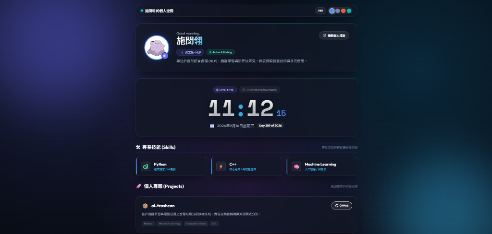

# ✨ Personal Space & Real-Time Clock Hub

一個現代化、優雅且具備毛玻璃（Glassmorphism）美學質感的個人專屬數位空間與作品集儀表板。

[](https://developer.mozilla.org/en-US/docs/Web/HTML)
[](https://developer.mozilla.org/en-US/docs/Web/CSS)
[](https://developer.mozilla.org/en-US/docs/Web/JavaScript)
[](LICENSE)

---

<p align="center">
  
</p>

---

## 🌟 核心功能特色 (Key Features)

### 👤 1. 個人檔案展示 (Profile & Avatar)
- **動態頭像框**：配備漸層發光環與懸浮微動畫，支援自訂頭像上傳。
- **個人資訊整合**：呈現姓名、時段感應問候語、專業領域標籤、在線狀態與個人簡介。

### 🛠 2. 專業技能展示 (Skills Showcase)
- **現代卡片式呈現**：以精緻毛玻璃卡片展示多種程式語言、工具與核心技術棧。
- **動態類別標記**：自帶對應圖示與技術類別說明，支援即時擴充與編輯。

### 🚀 3. 精選專案作品 (Projects Showcase)
- **專案成果卡片**：展示作品名稱、功能簡介、技術標籤與 GitHub 儲存庫直達捷徑。
- **自訂專案維護**：可依個人需求自訂或新增多個開源專案與研發成果。

### ✏️ 4. 即時個人檔案編輯器 (Interactive Profile Editor)
- **彈出式編輯視窗**：點擊「編輯個人檔案」即可直接在介面中編輯個人資訊。
- **支援欄位**：姓名、專業領域、個人簡介、技能清單（以逗號分隔）、頭像更換（支援本機上傳或輸入圖片網址）及專案詳情。
- **本地持久化儲存**：所有自訂資訊自動儲存至瀏覽器本地快取（`localStorage`），重新整理立即生效，並提供一鍵重設功能。

### 🕒 5. 高精度即時數位時鐘 & 主題切換 (Real-Time Clock & Themes)
- **高精度實時秒數更新**：即時時鐘計算、呼吸冒號動畫與毫秒級同步。
- **12H / 24H 自由切換**：自由切換 24 小時制或 12 小時制 (AM/PM) 模式。
- **完整日期與時區檢測**：自動偵測本地系統時區（如 UTC+08:00）、顯示完整年月日與年度累積天數（Day of Year）。
- **4 款毛玻璃配色主題**：
  - 🌌 **Aurora** (極光靛藍 - 預設)
  - 🔮 **Cyber** (賽博霓虹紫)
  - 🌅 **Sunset** (暮光暖橙)
  - 🌲 **Emerald** (午夜翡翠綠)
- **內建效率小工具**：今日焦點備忘錄 (Focus of the Day)、常用連結快速啟動 (Quick Launch) 與 25 分鐘番茄鐘專注計時器。

---

## 📁 專案架構 (Project Structure)

```text
├── assets/
│   ├── avatar.png        # 預設個人頭像
│   ├── preview.png       # 歷史預覽圖
│   └── preview-hub.png   # 最新儀表板預覽截圖
├── index.html            # 語意化 HTML5 結構與卡片佈局
├── style.css             # 毛玻璃設計系統、響應式佈局與 4 款主題
├── app.js                # 個人檔案狀態管理、時鐘引擎與編輯彈窗邏輯
├── .gitignore            # Git 忽略配置
└── README.md             # 專案說明文件
```

---

## 🚀 快速上手 (Quick Start)

無需安裝龐大相依套件，純原生 Web 技術構建：

### 方法一：直接打開網頁
使用任何現代瀏覽器（Chrome, Edge, Firefox, Safari）雙擊打開 `index.html` 即可體驗。

### 方法二：透過本機 HTTP 伺服器運行
```bash
# 使用 Python 內建伺服器
python -m http.server 3000

# 或使用 Node.js npx serve
npx serve .
```
開啟瀏覽器訪問 `http://localhost:3000` 即可使用！

---

## 🛠️ 技術棧 (Tech Stack)

- **前端核心**：HTML5, Vanilla CSS3, Modern ES6+ JavaScript
- **字體設計**：Google Fonts ([Outfit](https://fonts.google.com/specimen/Outfit), [Noto Sans TC](https://fonts.google.com/specimen/Noto+Sans+TC), [Space Grotesk](https://fonts.google.com/specimen/Space+Grotesk), [JetBrains Mono](https://fonts.google.com/specimen/JetBrains+Mono))
- **資料儲存**：瀏覽器 Web Storage API (`localStorage`)
- **檔案讀取**：Web File API & `FileReader`

---

## 📄 授權協議 (License)

本專案採用 [MIT License](LICENSE) 開源授權。
